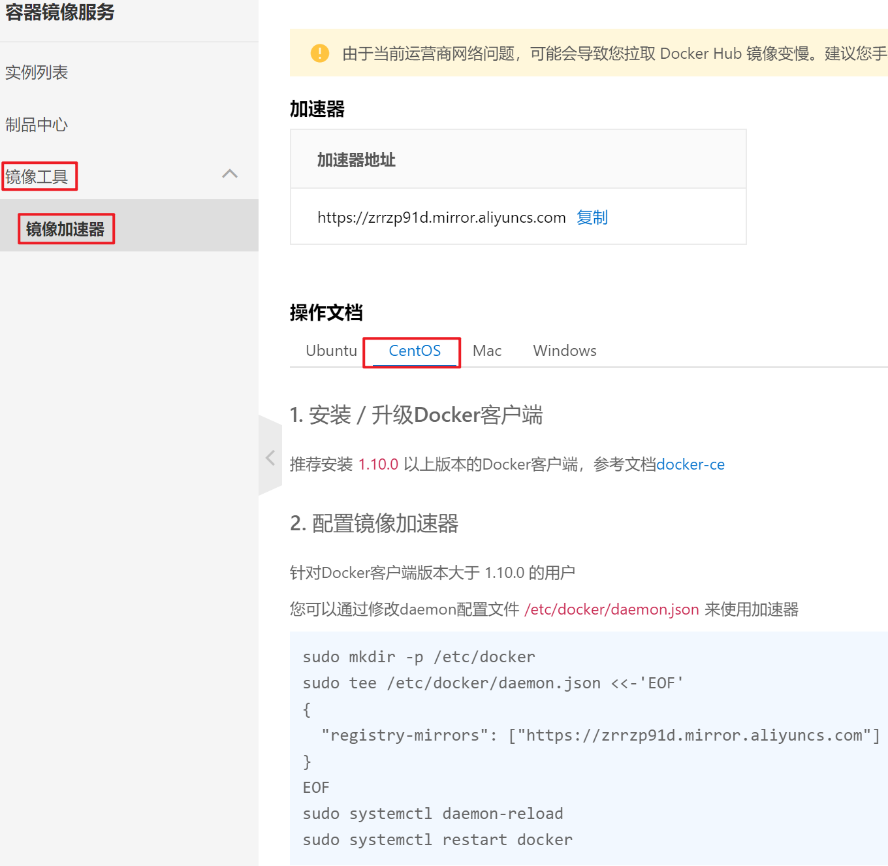

# 安装

## 安装Docker

> 环境准备

```shell
# 系统内核是3.10以上的
[root@sjk-0001 ~]# uname -r
5.4.262-1.el7.elrepo.x86_64

# 系统版本
[root@sjk-0001 ~]# cat /etc/os-release
NAME="CentOS Linux"
VERSION="7 (Core)"
ID="centos"
ID_LIKE="rhel fedora"
VERSION_ID="7"
PRETTY_NAME="CentOS Linux 7 (Core)"
ANSI_COLOR="0;31"
CPE_NAME="cpe:/o:centos:centos:7"
HOME_URL="https://www.centos.org/"
BUG_REPORT_URL="https://bugs.centos.org/"

CENTOS_MANTISBT_PROJECT="CentOS-7"
CENTOS_MANTISBT_PROJECT_VERSION="7"
REDHAT_SUPPORT_PRODUCT="centos"
REDHAT_SUPPORT_PRODUCT_VERSION="7"
```

>  安装

帮助文档：https://docs.docker.com/

```shell
# 1、卸载旧的版本
yum remove docker \
           docker-client \
           docker-client-latest \
           docker-common \
           docker-latest \
           docker-latest-logrotate \
           docker-logrotate \
           docker-selinux \
           docker-engine-selinux \
           docker-engine \
           docker-ce
# 2、需要的安装包
yum install -y yum-utils
# 3、设置镜像的仓库
yum-config-manager \
    --add-repo \
    https://mirrors.aliyun.com/docker-ce/linux/centos/docker-ce.repo   # 推荐使用阿里云的，十分的快
# 更新yum软件包索引
yum makecache fast
# 4、安装docker docker-ce 社区   ee 企业版
yum install -y docker-ce docker-ce-cli containerd.io
# 5、启动docker
systemctl start docker
# 6、查看docker是否安装成功
docker version
# 7、hello-world
docker run hello-world
# 8、查看一下下载的hello-world镜像
docker images
```

## 了解：卸载docker

```shell
# 1、卸载依赖
yum remove -y docker-ce docker-ce-cli containerd.io
# 2、删除资源
rm -rf /var/lib/docker
# /var/lib/docker     docker的默认工作路径！
```

## 阿里云镜像加速

1、登录阿里云找到容器服务


2、找到镜像加速地址



3、配置使用

```shell
sudo mkdir -p /etc/docker
sudo tee /etc/docker/daemon.json <<-'EOF'
{
  "registry-mirrors": ["https://zrrzp91d.mirror.aliyuncs.com"]
}
EOF
sudo systemctl daemon-reload
sudo systemctl restart docker
```

# 底层原理

Docker是怎么工作的？

Docker是一个Client-Server结构的系统，Docker的守护进程运行在主机上，通过Socket从客户端访问！

Docker-Server接收到Docker-Client的指令，就会执行这个命令！


**Docker为什么比VM快？**

1、Docker有着比虚拟机更少的抽象层

2、Docker利用的是宿主机的内核，vm需要的是Guest OS

所以说，新建一个容器的时候，docker不需要像虚拟机一样重新加载一个操作系统内核，避免引导。虚拟机是加载Guest OS，分钟级别的，而docker是利用宿主机的操作系统，省略了这个复杂的过程，秒级！

之后学习完毕所有的命令，再回过头来看这段理论，就会很清晰！

# docker的常用命令

## 帮助命令

```shell
docker version # 显示docker的版本信息
docker info # 显示docker的系统信息，包括镜像和容器的数量
```

帮助文档的地址：https://docs.docker.com/engine/reference/commandline/

## 镜像命令

**docker images**查看所有本地的主机上的镜像

```shell
[root@sjk-0001 ~]# docker images
REPOSITORY    TAG       IMAGE ID       CREATED         SIZE
minio/minio   latest    e31e0721a96b   23 months ago   406MB
# 解释
REPOSITORY  镜像的仓库源
TAG         镜像的标签
IMAGE ID    镜像的id
CREATED     镜像的创建时间
SIZE        镜像的大小
# 可选项
  -a, --all             # 列出所有的镜像
  -q, --quiet           # 只显示镜像的id
```

```shell
[root@sjk-0001 ~]# docker images -a
REPOSITORY    TAG       IMAGE ID       CREATED         SIZE
minio/minio   latest    e31e0721a96b   23 months ago   406MB
[root@sjk-0001 ~]# docker images -q
e31e0721a96b
```

**docker search搜索镜像**

```shell
[root@sjk-0001 ~]# docker search mysql
NAME                            DESCRIPTION                                      STARS     OFFICIAL   AUTOMATED
mysql                           MySQL is a widely used, open-source relation…   14687     [OK]       
mariadb                         MariaDB Server is a high performing open sou…   5603      [OK]       
percona                         Percona Server is a fork of the MySQL relati…   623       [OK]     
# 可选项，通过收藏来过滤
--filter=STARS=3000   搜索出来的镜像就是STARS大于3000的

```

```shell
[root@sjk-0001 ~]# docker search mysql --filter=STARS=3000
NAME      DESCRIPTION                                      STARS     OFFICIAL   AUTOMATED
mysql     MySQL is a widely used, open-source relation…   14687     [OK]       
mariadb   MariaDB Server is a high performing open sou…   5603      [OK]       
```

**dock pull**下载镜像

```shell
# 下载镜像 docker pull 镜像名[:tag]
[root@sjk-0001 ~]# docker pull mysql
```


md代码渲染比easy code formatter好

Ubuntu和Debian的包管理器是apt，Fedora的包管理器是dnf，Arch的包管理器是pacman

以前会抗拒使用linux，自从接触docker后，感觉linux没那么难

docker官方文档中为什么没有centos版本了？

\ 这啥意思  --add-repo 啥意思

md中<是什么

docker的官方镜像

先想想我们一般写作时候需要用到什么样的排版？ 

无非就是标题、引用、强调（加粗、斜体、下划线）、插入链接、插入图片、列表（有序和无序列表），甚至连表格都很少用。

typora图片保存在哪里？

使用docker安装gitlab，因为docker安装软件的成本相对低一些，不用提前安装依赖的环境，docker内部都弄好了

ctrl+i直接斜体

ctrl+b直接粗体

docker本质上是进程

docker就是部署环境用的

镜像=软件安装包 仓库=软件商店  容器=你的手机

shift+insert   粘贴(粘贴可按下鼠标滚轮)

前面说按鼠标滚轮的，学到了

stars你理解为收藏就行，stars数越高，证明这个镜像越靠谱越权威
